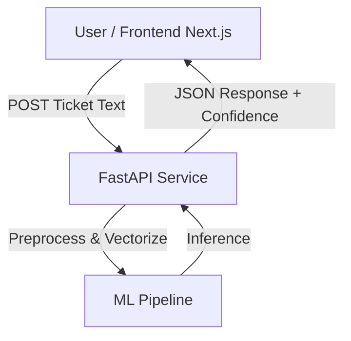

# AutoTicket – IT Service Ticket Classification

AutoTicket is an end-to-end machine learning project designed to automatically classify IT service tickets by **queue (department)** based on the textual description provided by the user.

The goal of this project is to simulate a real-world ITSM (IT Service Management) scenario, combining **NLP**, **API design**, and **modern web development** into a single, deployable system.

---
### Technologies


## Project Overview

The system takes a free-text ticket description and returns:

- Suggested IT queue (e.g., Hardware, Access, HR Support, etc.)
- Confidence score for the prediction.
- Top-3 predicted classes with probabilities.
- **Intelligent Routing:** Automatic review flagging when confidence is low.

The architecture is intentionally split into two services to reflect production best practices.

---

## Architecture



## Frontend (Next.js + TypeScript)
* Interface for entering ticket descriptions.
* Communicates with the ML API via server-side proxy.
* Visualizes confidence levels and alerts users if manual review is needed.
* Styled with Tailwind CSS.

## Backend (FastAPI + Python)
* Loads the trained scikit-learn pipeline.
* Performs real-time inference.
* Implements business logic for confidence thresholds.
* Returns structured JSON responses.

## Machine Learning Approach
### Dataset
**IT Service Ticket Classification Dataset**

*~48,000 tickets.*

8 distinct categories (e.g., "Access", "Hardware", "HR Support").

### Model Pipeline (Lightweight & Efficient)
Instead of using heavy Transformer models, this project utilizes a highly efficient Sparse NLP approach suitable for CPU deployment:
* Vectorization: Hybrid Feature Union of:  
  * Word-level TF-IDF (1-2 ngrams) to capture keywords.
  * Character-level TF-IDF (3-5 ngrams) to handle typos and sub-word information.

* Classifier: SGDClassifier with log-loss (Stochastic Gradient Descent).
  * Calibrated to output probabilities similar to Logistic Regression.
  * Optimized for class balance using class_weight='balanced'.

### Performance
The model achieves production-grade metrics with very low latency:
|       |  |
| ----------- | ----------- |
| Accuracy    | 86.5%      |
| Macro F1-score   | 0.866        |

## Confidence-Based Routing Logic
Instead of blindly trusting predictions, the system applies custom confidence thresholds per category (e.g., 'Hardware' requires lower confidence than 'Access'):
* High Confidence: Automatic assignment.
* Low Confidence (< Threshold): Routed to REVIEW_QUEUE.

Example Response:
```
{
  "queue": "REVIEW",
  "queue_label": "Hardware",
  "queue_confidence": 0.45,
  "queue_top3": [
    ["Hardware", 0.45],
    ["Access", 0.31],
    ["Miscellaneous", 0.15]
  ]
}
```
*This mimics real-world ITSM automation workflows to prevent misrouting.*


### Current Status
This project is actively under development.
Planned improvements:

* [ ] Add Active Learning loop for low-confidence samples.
* [ ] Improve the model's results


